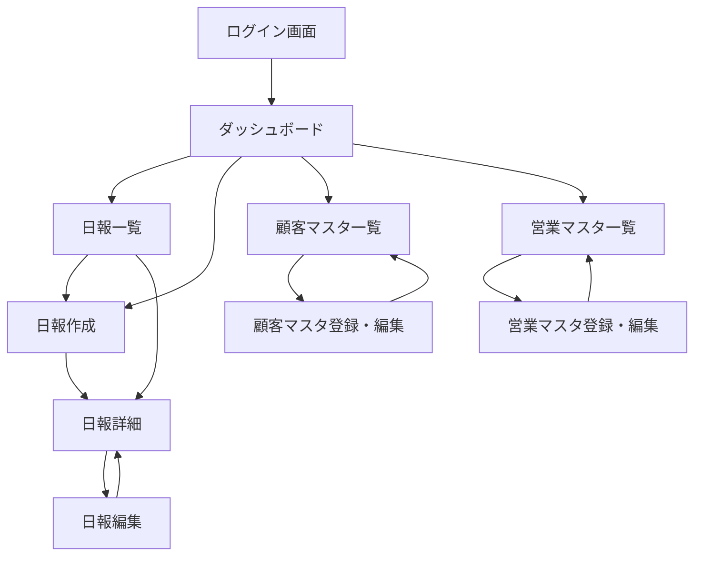

# 営業日報システム 画面定義書

## 改訂履歴

| バージョン | 日付 | 内容 |
|-----------|------|------|
| 1.0 | 2026-05-23 | 初版作成 |

---

## 画面一覧

| 画面ID | 画面名 | 対象ユーザー |
|--------|--------|-------------|
| SCR-01 | ログイン画面 | 全ユーザー |
| SCR-02 | ダッシュボード | 全ユーザー |
| SCR-03 | 日報一覧画面 | 全ユーザー |
| SCR-04 | 日報作成画面 | 営業 |
| SCR-05 | 日報詳細画面 | 全ユーザー |
| SCR-06 | 日報編集画面 | 営業 |
| SCR-07 | 顧客マスタ一覧画面 | 全ユーザー |
| SCR-08 | 顧客マスタ登録・編集画面 | 上長 |
| SCR-09 | 営業マスタ一覧画面 | 上長 |
| SCR-10 | 営業マスタ登録・編集画面 | 上長 |

---

## 画面遷移図



---

## SCR-01 ログイン画面

### 概要
システムへの認証を行う画面。

### 対象ユーザー
全ユーザー（営業・上長）

### レイアウト

```
┌─────────────────────────────────┐
│                                 │
│        営業日報システム          │
│                                 │
│  メールアドレス                  │
│  ┌───────────────────────────┐  │
│  │ example@company.com       │  │
│  └───────────────────────────┘  │
│                                 │
│  パスワード                      │
│  ┌───────────────────────────┐  │
│  │ ••••••••                  │  │
│  └───────────────────────────┘  │
│                                 │
│  ┌───────────────────────────┐  │
│  │       ログイン             │  │
│  └───────────────────────────┘  │
│                                 │
└─────────────────────────────────┘
```

### 入力項目

| 項目名 | 種別 | 必須 | バリデーション |
|--------|------|------|--------------|
| メールアドレス | テキスト | ○ | メール形式、255文字以内 |
| パスワード | パスワード | ○ | 8文字以上 |

### アクション

| ボタン | 処理 | 遷移先 |
|--------|------|--------|
| ログイン | 認証処理 | 成功 → SCR-02、失敗 → エラーメッセージ表示 |

### エラーメッセージ

| ケース | メッセージ |
|--------|-----------|
| 未入力 | 「メールアドレスとパスワードを入力してください」 |
| 認証失敗 | 「メールアドレスまたはパスワードが正しくありません」 |
| アカウントロック | 「アカウントがロックされています。管理者にお問い合わせください」 |

---

## SCR-02 ダッシュボード

### 概要
ログイン後のトップ画面。自分の当日日報の状況と最新の日報フィードを確認できる。

### 対象ユーザー
全ユーザー（営業・上長）

### レイアウト

```
┌──────────────────────────────────────────────────┐
│ 営業日報システム         山田 太郎（営業） [ログアウト] │
├──────┬───────────────────────────────────────────┤
│      │  ダッシュボード                              │
│ ナビ │                                             │
│      │  ┌─────────────────┐ ┌──────────────────┐  │
│ ダッシュ│  │  本日の日報       │ │  未読コメント     │  │
│ ボード│  │  未提出           │ │  3件             │  │
│      │  │  [日報を作成する] │ │  [確認する]      │  │
│ 日報 │  └─────────────────┘ └──────────────────┘  │
│ 一覧 │                                             │
│      │  最新の日報（チーム）                        │
│ 顧客 │  ┌──────────────────────────────────────┐  │
│ マスタ│  │ 2026-05-23 鈴木 一郎   [コメント 2件] │  │
│      │  │ 2026-05-23 田中 花子   [コメント 0件] │  │
│ 営業 │  │ 2026-05-22 山田 太郎   [コメント 1件] │  │
│ マスタ│  └──────────────────────────────────────┘  │
│      │                                             │
└──────┴───────────────────────────────────────────┘
```

### 表示内容

| エリア | 表示内容 | 備考 |
|--------|---------|------|
| 本日の日報ステータス | 提出済 / 未提出 | 営業のみ表示 |
| 未読コメント数 | 自分の日報への未読コメント件数 | 営業のみ表示 |
| 最新の日報フィード | チーム全員の最新10件 | 上長は全員分、営業は自分のみ |

### アクション

| ボタン | 処理 | 遷移先 |
|--------|------|--------|
| 日報を作成する | 当日日報作成 | SCR-04 |
| 確認する | 未読コメント一覧 | SCR-03（フィルタあり） |
| 日報行クリック | 日報詳細表示 | SCR-05 |

---

## SCR-03 日報一覧画面

### 概要
日報の一覧を検索・閲覧する画面。

### 対象ユーザー
全ユーザー（営業は自分のみ、上長は全員分）

### レイアウト

```
┌──────────────────────────────────────────────────┐
│ 営業日報システム         山田 太郎（営業） [ログアウト] │
├──────┬───────────────────────────────────────────┤
│      │  日報一覧                  [+ 新規作成]     │
│ ナビ │                                             │
│      │  ┌──────────────────────────────────────┐  │
│      │  │ 期間: [2026-05-01] ～ [2026-05-31]    │  │
│      │  │ 担当者: [全員 ▼]         [検索]       │  │
│      │  └──────────────────────────────────────┘  │
│      │                                             │
│      │  ┌────┬──────────┬──────┬────────────────┐ │
│      │  │日付│担当者    │訪問数│コメント        │ │
│      │  ├────┼──────────┼──────┼────────────────┤ │
│      │  │5/23│山田 太郎 │3件   │2件（未読1）    │ │
│      │  │5/23│鈴木 一郎 │2件   │0件             │ │
│      │  │5/22│山田 太郎 │4件   │1件             │ │
│      │  └────┴──────────┴──────┴────────────────┘ │
│      │                                             │
│      │  << 前へ  1 / 5  次へ >>                   │
└──────┴───────────────────────────────────────────┘
```

### 検索条件

| 項目名 | 種別 | 初期値 | 備考 |
|--------|------|--------|------|
| 期間（開始） | 日付 | 当月1日 | |
| 期間（終了） | 日付 | 本日 | |
| 担当者 | プルダウン | 全員 | 上長のみ表示。営業は自分固定 |

### 一覧表示項目

| 項目名 | 説明 |
|--------|------|
| 日付 | 日報の対象日 |
| 担当者 | 日報作成者名 |
| 訪問件数 | 当日の訪問記録件数 |
| コメント | コメント総数（未読数） |

### アクション

| ボタン・操作 | 処理 | 遷移先 |
|-------------|------|--------|
| 新規作成 | 当日日報の作成 | SCR-04 |
| 検索 | 絞り込み検索実行 | 同画面（結果更新） |
| 行クリック | 日報詳細表示 | SCR-05 |

---

## SCR-04 日報作成画面

### 概要
当日の訪問記録・Problem・Plan を入力して日報を新規作成する画面。

### 対象ユーザー
営業

### レイアウト

```
┌──────────────────────────────────────────────────┐
│ 営業日報システム         山田 太郎（営業） [ログアウト] │
├──────┬───────────────────────────────────────────┤
│      │  日報作成  2026年5月23日（金）              │
│ ナビ │                                             │
│      │  ■ 訪問記録                                 │
│      │  ┌──────────────────────────────────────┐  │
│      │  │ # │ 顧客名           │ 訪問内容        │ │
│      │  ├───┼──────────────────┼────────────────┤ │
│      │  │ 1 │ [株式会社〇〇 ▼] │ [提案書を提出…] │ │
│      │  │ 2 │ [△△商事   ▼] │ [ヒアリング実施] │ │
│      │  │ + │ [行を追加する]                    │ │
│      │  └──────────────────────────────────────┘  │
│      │                                             │
│      │  ■ Problem（今の課題・相談）                │
│      │  ┌──────────────────────────────────────┐  │
│      │  │                                      │  │
│      │  │                                      │  │
│      │  └──────────────────────────────────────┘  │
│      │                                             │
│      │  ■ Plan（明日やること）                     │
│      │  ┌──────────────────────────────────────┐  │
│      │  │                                      │  │
│      │  │                                      │  │
│      │  └──────────────────────────────────────┘  │
│      │                                             │
│      │         [キャンセル]  [提出する]             │
└──────┴───────────────────────────────────────────┘
```

### 入力項目

#### 訪問記録（複数行）

| 項目名 | 種別 | 必須 | バリデーション |
|--------|------|------|--------------|
| 顧客名 | プルダウン（顧客マスタから選択） | ○ | 顧客マスタに存在すること |
| 訪問内容 | テキストエリア | ○ | 1000文字以内 |

#### Problem・Plan

| 項目名 | 種別 | 必須 | バリデーション |
|--------|------|------|--------------|
| Problem | テキストエリア | × | 2000文字以内 |
| Plan | テキストエリア | × | 2000文字以内 |

### アクション

| ボタン | 処理 | 遷移先 |
|--------|------|--------|
| 行を追加する | 訪問記録行を1行追加 | 同画面 |
| 行の削除（各行） | 対象行を削除 | 同画面 |
| キャンセル | 入力破棄 | SCR-03 |
| 提出する | 日報を保存 | SCR-05（作成した日報の詳細） |

### バリデーション

| ケース | メッセージ |
|--------|-----------|
| 訪問記録が0件 | 「訪問記録を1件以上入力してください」 |
| 顧客未選択 | 「顧客を選択してください」 |
| 訪問内容が未入力 | 「訪問内容を入力してください」 |
| 当日の日報が既に存在 | 「本日の日報はすでに提出されています」 |

---

## SCR-05 日報詳細画面

### 概要
日報の内容を閲覧し、上長がコメントを投稿できる画面。

### 対象ユーザー
全ユーザー

### レイアウト

```
┌──────────────────────────────────────────────────┐
│ 営業日報システム         山田 太郎（営業） [ログアウト] │
├──────┬───────────────────────────────────────────┤
│      │  日報詳細                    [編集] [削除]  │
│ ナビ │  山田 太郎  2026年5月23日（金）             │
│      │                                             │
│      │  ■ 訪問記録                                 │
│      │  ┌──────────────────────────────────────┐  │
│      │  │ # │ 顧客名      │ 訪問内容            │  │
│      │  ├───┼─────────────┼────────────────────┤  │
│      │  │ 1 │ 株式会社〇〇 │ 提案書を提出し…     │  │
│      │  │ 2 │ △△商事    │ ヒアリングを実施し… │  │
│      │  └──────────────────────────────────────┘  │
│      │                                             │
│      │  ■ Problem（今の課題・相談）                │
│      │  ┌──────────────────────────────────────┐  │
│      │  │ 〇〇社の意思決定者にアプローチできて   │  │
│      │  │ いない。どのように接触すべきか…        │  │
│      │  └──────────────────────────────────────┘  │
│      │                                             │
│      │  ■ Plan（明日やること）                     │
│      │  ┌──────────────────────────────────────┐  │
│      │  │ ・△△商事にフォローアップの電話         │  │
│      │  │ ・提案書の修正                          │  │
│      │  └──────────────────────────────────────┘  │
│      │                                             │
│      │  ■ コメント                                 │
│      │  ┌──────────────────────────────────────┐  │
│      │  │ 佐藤 部長  2026-05-23 18:00            │  │
│      │  │ 〇〇社の件は、まず担当窓口に…           │  │
│      │  └──────────────────────────────────────┘  │
│      │  ┌──────────────────────────────────────┐  │
│      │  │ [コメントを入力…                     ] │  │
│      │  │                          [送信]        │  │
│      │  └──────────────────────────────────────┘  │
└──────┴───────────────────────────────────────────┘
```

### 表示内容

| エリア | 表示内容 | 備考 |
|--------|---------|------|
| ヘッダー | 担当者名・日報日付 | |
| 訪問記録 | 顧客名・訪問内容の一覧 | 訪問順に表示 |
| Problem | 課題・相談テキスト | 未入力の場合は「記入なし」 |
| Plan | 明日やることテキスト | 未入力の場合は「記入なし」 |
| コメント | 投稿者名・投稿日時・本文 | 投稿日時の昇順 |
| コメント入力欄 | テキストエリア＋送信ボタン | 上長のみ表示 |

### アクション

| ボタン・操作 | 権限 | 処理 | 遷移先 |
|-------------|------|------|--------|
| 編集 | 日報作成者（当日のみ） | 日報編集画面へ | SCR-06 |
| 削除 | 日報作成者（当日のみ） | 確認ダイアログ → 削除 | SCR-03 |
| コメント送信 | 上長のみ | コメントを保存 | 同画面（コメント追加） |

### コメントのバリデーション

| ケース | メッセージ |
|--------|-----------|
| コメントが空 | 「コメントを入力してください」 |
| 2000文字超 | 「2000文字以内で入力してください」 |

---

## SCR-06 日報編集画面

### 概要
提出済みの日報を編集する画面。当日中のみ編集可能。

### 対象ユーザー
営業（日報作成者本人、当日のみ）

### レイアウト
SCR-04（日報作成画面）と同レイアウト。既存データが入力欄に初期値として表示される。

### 入力項目
SCR-04 と同じ。

### アクション

| ボタン | 処理 | 遷移先 |
|--------|------|--------|
| キャンセル | 編集破棄 | SCR-05 |
| 更新する | 日報を上書き保存 | SCR-05（更新した日報の詳細） |

### バリデーション
SCR-04 と同じ。

---

## SCR-07 顧客マスタ一覧画面

### 概要
顧客マスタの一覧を閲覧・検索する画面。

### 対象ユーザー
全ユーザー（登録・編集・削除は上長のみ）

### レイアウト

```
┌──────────────────────────────────────────────────┐
│ 営業日報システム         佐藤 部長（上長） [ログアウト] │
├──────┬───────────────────────────────────────────┤
│      │  顧客マスタ                    [+ 新規登録] │
│ ナビ │                                             │
│      │  ┌──────────────────────────────────────┐  │
│      │  │ 顧客名 / 会社名: [          ] [検索]  │  │
│      │  └──────────────────────────────────────┘  │
│      │                                             │
│      │  ┌────────────┬────────────┬────────────┐  │
│      │  │ 顧客名     │ 会社名     │ 操作       │  │
│      │  ├────────────┼────────────┼────────────┤  │
│      │  │ 鈴木 様    │ 株式会社〇〇 │ [編集][削除]│  │
│      │  │ 田中 様    │ △△商事   │ [編集][削除]│  │
│      │  └────────────┴────────────┴────────────┘  │
│      │                                             │
│      │  << 前へ  1 / 3  次へ >>                   │
└──────┴───────────────────────────────────────────┘
```

### 表示項目

| 項目名 | 説明 |
|--------|------|
| 顧客名 | 担当者名 |
| 会社名 | 所属会社名 |
| 操作 | 編集・削除ボタン（上長のみ表示） |

### アクション

| ボタン | 権限 | 処理 | 遷移先 |
|--------|------|------|--------|
| 新規登録 | 上長 | 登録画面へ | SCR-08 |
| 編集 | 上長 | 編集画面へ | SCR-08 |
| 削除 | 上長 | 確認ダイアログ → 削除 | 同画面 |
| 検索 | 全員 | 絞り込み | 同画面 |

---

## SCR-08 顧客マスタ登録・編集画面

### 概要
顧客の新規登録または既存顧客の情報を編集する画面。

### 対象ユーザー
上長

### レイアウト

```
┌──────────────────────────────────────────────────┐
│ 営業日報システム         佐藤 部長（上長） [ログアウト] │
├──────┬───────────────────────────────────────────┤
│      │  顧客マスタ登録                             │
│ ナビ │                                             │
│      │  会社名 *                                   │
│      │  ┌──────────────────────────────────────┐  │
│      │  │ 株式会社〇〇                          │  │
│      │  └──────────────────────────────────────┘  │
│      │                                             │
│      │  顧客名（担当者名） *                        │
│      │  ┌──────────────────────────────────────┐  │
│      │  │ 鈴木 様                               │  │
│      │  └──────────────────────────────────────┘  │
│      │                                             │
│      │  電話番号                                   │
│      │  ┌──────────────────────────────────────┐  │
│      │  │ 03-0000-0000                          │  │
│      │  └──────────────────────────────────────┘  │
│      │                                             │
│      │  住所                                       │
│      │  ┌──────────────────────────────────────┐  │
│      │  │ 東京都〇〇区…                         │  │
│      │  └──────────────────────────────────────┘  │
│      │                                             │
│      │         [キャンセル]  [保存する]             │
└──────┴───────────────────────────────────────────┘
```

### 入力項目

| 項目名 | 種別 | 必須 | バリデーション |
|--------|------|------|--------------|
| 会社名 | テキスト | ○ | 255文字以内 |
| 顧客名 | テキスト | ○ | 255文字以内 |
| 電話番号 | テキスト | × | 電話番号形式、20文字以内 |
| 住所 | テキスト | × | 500文字以内 |

### アクション

| ボタン | 処理 | 遷移先 |
|--------|------|--------|
| キャンセル | 入力破棄 | SCR-07 |
| 保存する | 登録 / 更新 | SCR-07 |

---

## SCR-09 営業マスタ一覧画面

### 概要
営業担当者・上長のアカウント一覧を閲覧・管理する画面。

### 対象ユーザー
上長

### レイアウト

```
┌──────────────────────────────────────────────────┐
│ 営業日報システム         佐藤 部長（上長） [ログアウト] │
├──────┬───────────────────────────────────────────┤
│      │  営業マスタ                    [+ 新規登録] │
│ ナビ │                                             │
│      │  ┌────────┬───────────┬──────┬──────────┐  │
│      │  │ 氏名   │ メール    │ 役割 │ 操作     │  │
│      │  ├────────┼───────────┼──────┼──────────┤  │
│      │  │山田 太郎│ yamada@… │ 営業 │[編集][削除]│ │
│      │  │佐藤 部長│ sato@…  │ 上長 │[編集][削除]│ │
│      │  └────────┴───────────┴──────┴──────────┘  │
│      │                                             │
│      │  << 前へ  1 / 1  次へ >>                   │
└──────┴───────────────────────────────────────────┘
```

### 表示項目

| 項目名 | 説明 |
|--------|------|
| 氏名 | ユーザーの氏名 |
| メール | ログイン用メールアドレス |
| 役割 | 営業 / 上長 |
| 操作 | 編集・削除ボタン |

### アクション

| ボタン | 処理 | 遷移先 |
|--------|------|--------|
| 新規登録 | 登録画面へ | SCR-10 |
| 編集 | 編集画面へ | SCR-10 |
| 削除 | 確認ダイアログ → 削除 | 同画面 |

---

## SCR-10 営業マスタ登録・編集画面

### 概要
営業担当者・上長のアカウントを登録または編集する画面。

### 対象ユーザー
上長

### レイアウト

```
┌──────────────────────────────────────────────────┐
│ 営業日報システム         佐藤 部長（上長） [ログアウト] │
├──────┬───────────────────────────────────────────┤
│      │  営業マスタ登録                             │
│ ナビ │                                             │
│      │  氏名 *                                     │
│      │  ┌──────────────────────────────────────┐  │
│      │  │ 山田 太郎                             │  │
│      │  └──────────────────────────────────────┘  │
│      │                                             │
│      │  メールアドレス *                            │
│      │  ┌──────────────────────────────────────┐  │
│      │  │ yamada@company.com                   │  │
│      │  └──────────────────────────────────────┘  │
│      │                                             │
│      │  役割 *                                     │
│      │  ○ 営業  ○ 上長                            │
│      │                                             │
│      │  部署                                       │
│      │  ┌──────────────────────────────────────┐  │
│      │  │ 東日本営業部                          │  │
│      │  └──────────────────────────────────────┘  │
│      │                                             │
│      │  初期パスワード *  ※編集時は変更時のみ入力   │
│      │  ┌──────────────────────────────────────┐  │
│      │  │ ••••••••                              │  │
│      │  └──────────────────────────────────────┘  │
│      │                                             │
│      │         [キャンセル]  [保存する]             │
└──────┴───────────────────────────────────────────┘
```

### 入力項目

| 項目名 | 種別 | 必須 | バリデーション |
|--------|------|------|--------------|
| 氏名 | テキスト | ○ | 100文字以内 |
| メールアドレス | テキスト | ○ | メール形式、重複不可、255文字以内 |
| 役割 | ラジオボタン | ○ | 営業 / 上長 |
| 部署 | テキスト | × | 100文字以内 |
| 初期パスワード | パスワード | ○（新規のみ） | 8文字以上 |

### アクション

| ボタン | 処理 | 遷移先 |
|--------|------|--------|
| キャンセル | 入力破棄 | SCR-09 |
| 保存する | 登録 / 更新 | SCR-09 |

---

## 共通仕様

### ナビゲーション

| メニュー項目 | 表示条件 | 遷移先 |
|-------------|---------|--------|
| ダッシュボード | 全員 | SCR-02 |
| 日報一覧 | 全員 | SCR-03 |
| 日報作成 | 営業のみ | SCR-04 |
| 顧客マスタ | 全員 | SCR-07 |
| 営業マスタ | 上長のみ | SCR-09 |
| ログアウト | 全員 | SCR-01 |

### 権限マトリクス

| 操作 | 営業（本人） | 営業（他人） | 上長 |
|------|:-----------:|:-----------:|:----:|
| 日報作成 | ○ | × | × |
| 日報閲覧 | ○ | × | ○（全員分）|
| 日報編集 | ○（当日のみ） | × | × |
| 日報削除 | ○（当日のみ） | × | × |
| コメント投稿 | × | × | ○ |
| 顧客マスタ閲覧 | ○ | — | ○ |
| 顧客マスタ編集 | × | — | ○ |
| 営業マスタ閲覧 | × | — | ○ |
| 営業マスタ編集 | × | — | ○ |
