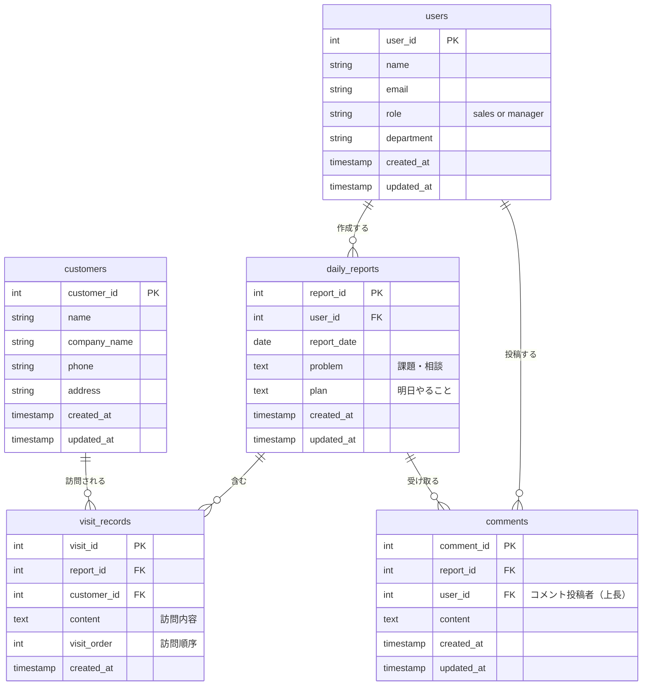

# 営業日報システム 要件定義書

## 改訂履歴

| バージョン | 日付 | 内容 |
|-----------|------|------|
| 1.0 | 2026-05-23 | 初版作成 |

---

## システム概要

営業担当者が日々の活動を記録・報告し、上長がフィードバックできる営業日報システム。

---

## 機能要件

### 1. マスタ管理

| # | 機能 | 説明 |
|---|------|------|
| M-1 | 営業マスタ | 営業担当者・上長の情報を管理する |
| M-2 | 顧客マスタ | 訪問先顧客の情報を管理する |

### 2. 日報管理

| # | 機能 | 説明 |
|---|------|------|
| R-1 | 日報作成 | 営業担当者が1日1件の日報を作成する |
| R-2 | 訪問記録登録 | 1日報に対して訪問顧客と訪問内容を複数行登録する |
| R-3 | Problem 入力 | 現在の課題・相談事項を記入する |
| R-4 | Plan 入力 | 翌日の行動計画を記入する |
| R-5 | 日報編集・削除 | 当日中は編集・削除可能 |

### 3. コメント機能

| # | 機能 | 説明 |
|---|------|------|
| C-1 | コメント投稿 | 上長が日報の Problem / Plan に対してコメントを投稿する |
| C-2 | コメント閲覧 | 営業担当者・上長がコメントを確認できる |

---

## 非機能要件

- ロールは「営業」「上長」の2種類
- 日報は1ユーザー1日1件まで
- 訪問記録は1日報に対して件数制限なし

---

## ER図

---

## テーブル間の関係

| 関係 | カーディナリティ | 説明 |
|------|----------------|------|
| users → daily_reports | 1対多 | 1人の営業が複数日報を持つ |
| daily_reports → visit_records | 1対多 | 1日報に複数の訪問記録 |
| customers → visit_records | 1対多 | 1顧客が複数日報に登場しうる |
| daily_reports → comments | 1対多 | 1日報に複数コメント |
| users → comments | 1対多 | 1上長が複数コメントを投稿 |
